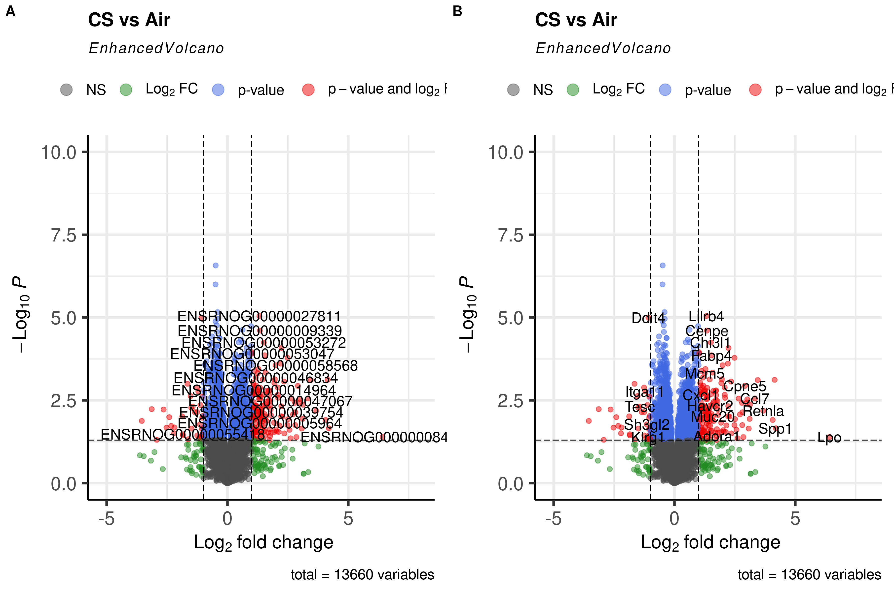
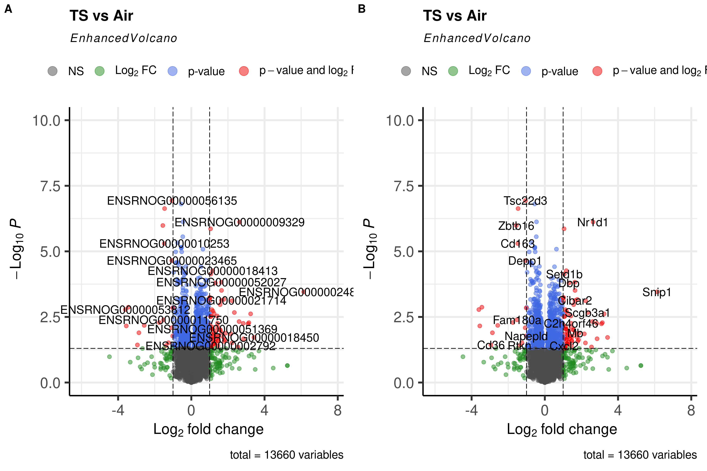
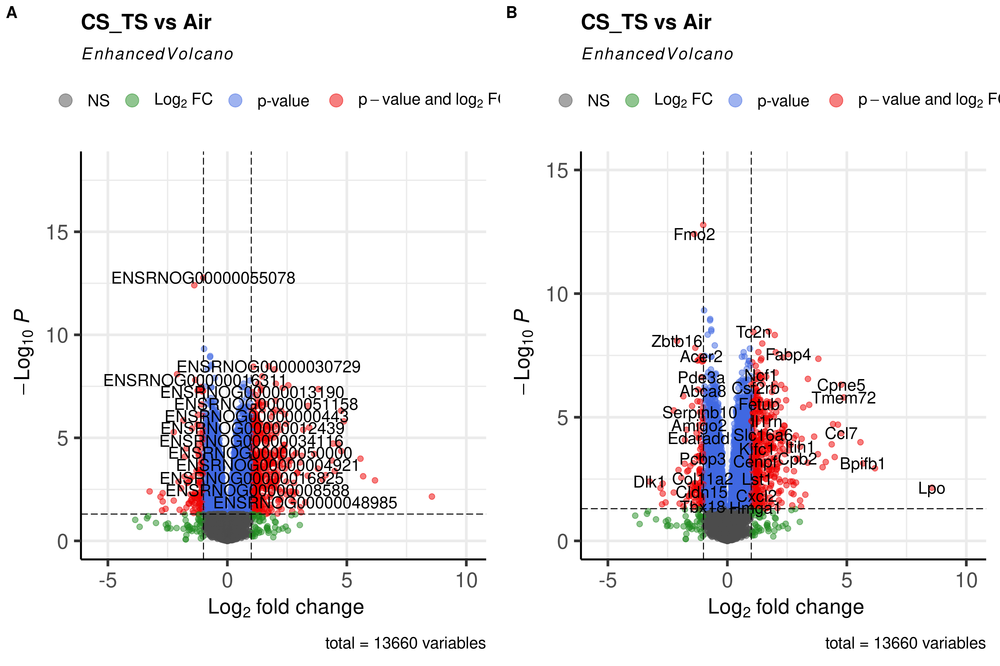
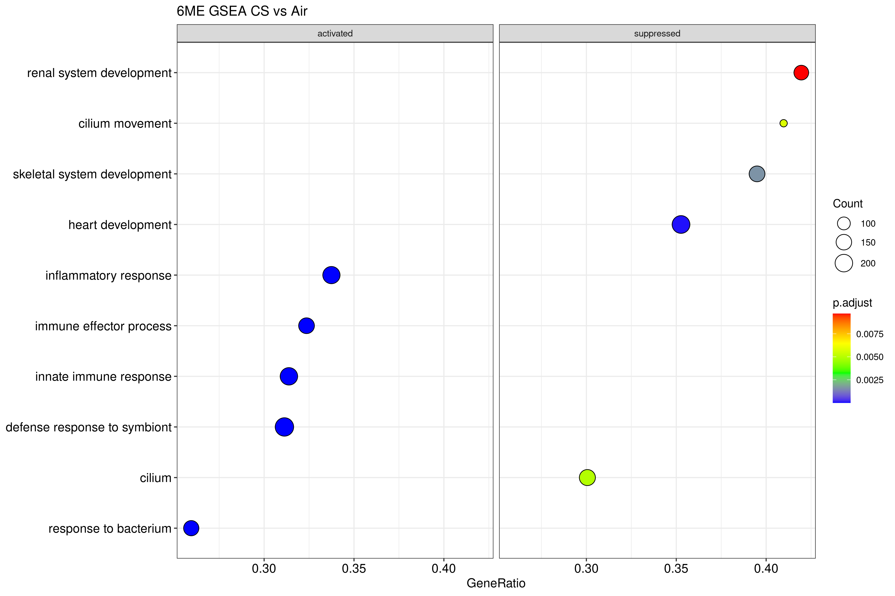
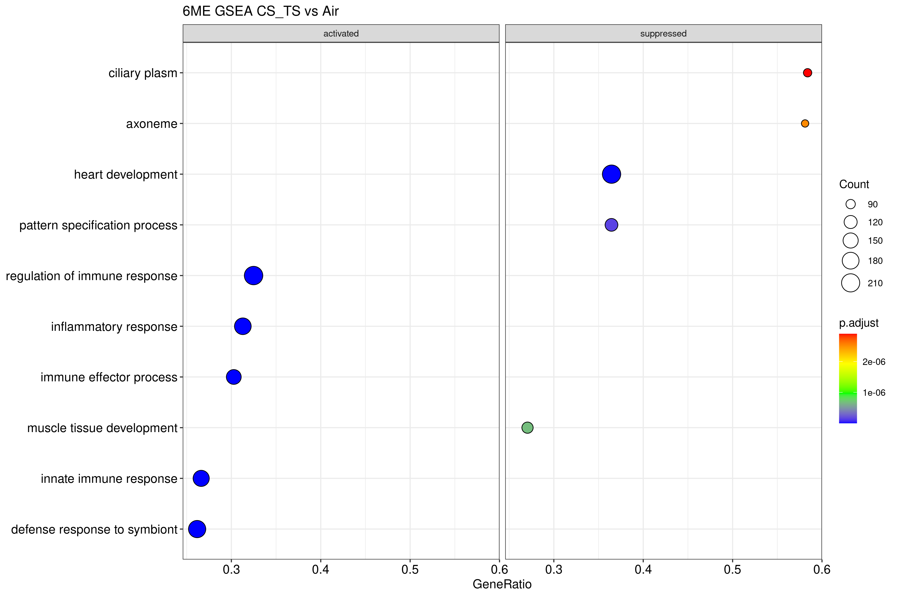
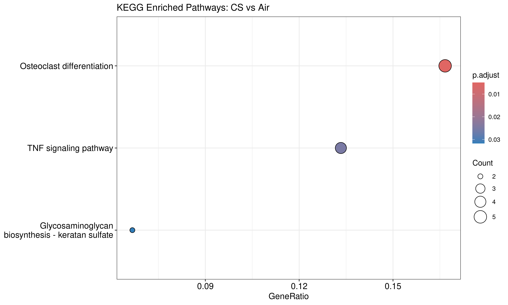
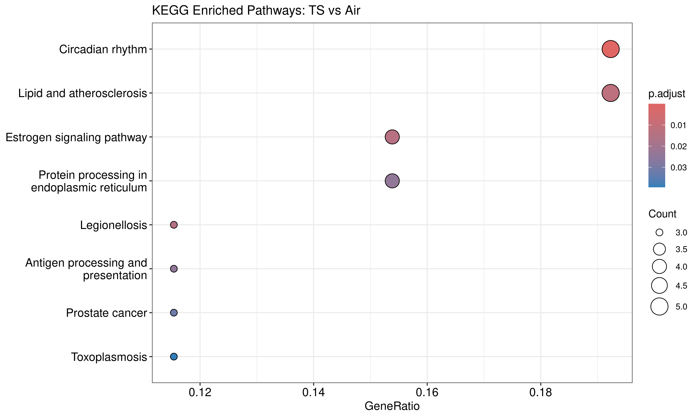
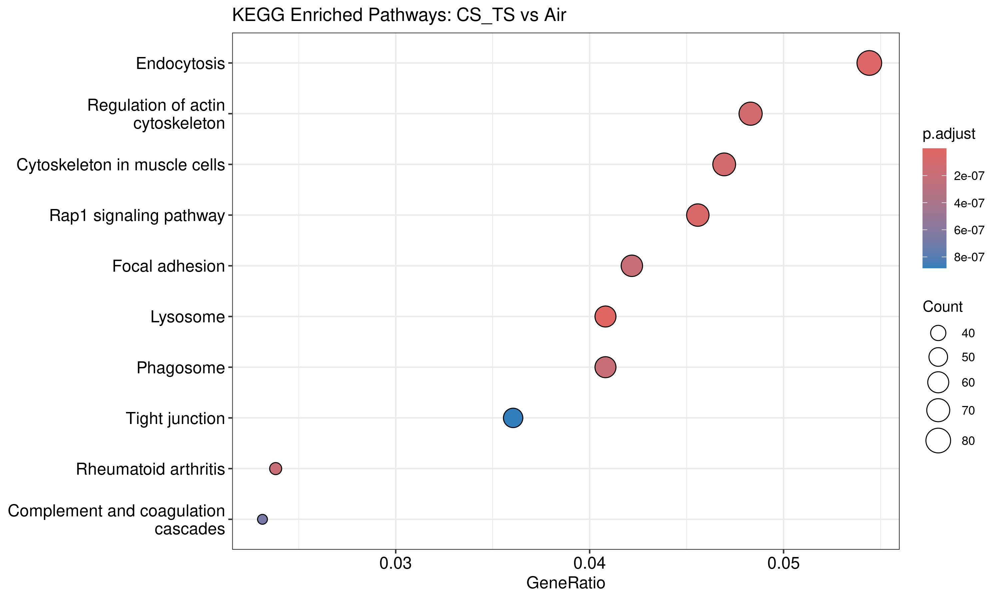
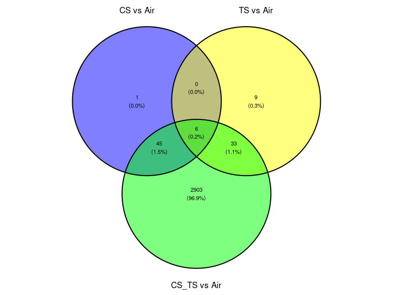

# Silica-Tobacco Smoke Study Report

### Introduction
Determine lung toxicity and gene expression profiles in rats exposed to crystalline silica (CS) and tobacco smoke (TS) and their combination (CS+TS) for 6 months exposure (6ME) group. 

### Objective of the Study
The primary objective of this study is to investigate the effect of crystalline silica (CS), Tobacco Smoke (TS) and combined effects of crystalline silica (CS) and tobacco smoke (TS) on lung toxicity and gene expression profiles in rats.

Specifically, the study aims to:

1. Determine Lung Toxicity: Assess lung toxicity in rats exposed to different conditions (Control(Air), CS, TS, and CS + TS) over a 6-month period (6ME-Month Exposure).

2. Analyze Gene Expression Profiles: Identify differentially expressed genes (DEGs) in the lungs of rats across the different exposure groups.

3. Perform Bioinformatics Analysis: Conduct comprehensive bioinformatics analyses, including principal component analysis (PCA), differential expression analysis, pathway enrichment analysis, and gene set enrichment analysis (GSEA), to uncover the biological pathways and molecular mechanisms affected by CS and TS exposure.

By achieving these objectives, the study seeks to enhance our understanding of the pulmonary effects of CS and TS, both individually and in combination, and to provide insights into the potential health risks associated with these exposures.

###  Study Design
A total of 72 rats were divided into 4 groups: Control (Air), Crystalline Silica (CS), Tobacco Smoke (TS), and CS + TS. After 6 months, 6 rats from each group were euthanize to assess lung toxicity and gene expression.

### Materials and Methods
Animal Groups and Treatment
Detail the division of rats into groups and the specific treatments administered:

**Rat IDs:**

6-months exposure group (6ME)

a.	Control (1-6)
b.	CS (13-18)
c.	TS (25-30)
d.	CS + TS (37-42)

### Gene Expression Analysis

Statistical Analysis- The normalized counts were used to perform differential expression analysis using the limma package. Contrasts were defined to compare each treatment group to the control group. The voom function was used to transform the count data for linear modeling. The results were then analyzed to identify differentially expressed genes with adjusted p-values < 0.05.

### PCA Plot

**PCA Analysis**
Principal Component Analysis (PCA) was performed on the gene expression data to visualize the variance between the different treatment groups. PCA is a dimensional reduction technique that helps to identify patterns in high-dimensional data by transforming it into principal components, which are linear combinations of the original variables.

**PCA Before Normalization**
Before normalization, the PCA plot shows the distribution of samples based on their raw gene expression counts. Each point represents a sample, and the colors indicate the treatment groups: Control (Air), Crystalline Silica (CS), Tobacco Smoke (TS), and CS + TS. The plot reveals the inherent variability in the raw data, with some overlap between groups. This overlap suggests that the raw data may contain batch effects or other technical variations that obscure the biological differences between the groups.

**PCA After Normalization**
After normalization, the PCA plot displays the distribution of samples based on their normalized gene expression counts. Normalization adjusts for technical variations and ensures that the differences observed are due to biological factors. In this plot, the treatment groups are more distinctly separated, indicating that the normalization process successfully reduced the noise and highlighted the true biological differences between the groups. The clear separation between groups after normalization demonstrates the effectiveness of the normalization process in preparing the data for downstream differential expression analysis.


```{r setup, include=FALSE}
knitr::opts_chunk$set(echo = TRUE)
# Load necessary libraries
if (!requireNamespace("BiocManager", quietly = TRUE))
  install.packages("BiocManager")
BiocManager::install("edgeR")
library(edgeR)
library(ggplot2)
library(ggrepel)
library(limma)
BiocManager::install("EnhancedVolcano")
library(EnhancedVolcano)
library(ggvenn)
BiocManager::install("DOSE")
library(DOSE)
BiocManager::install("clusterProfiler")
library(clusterProfiler)
BiocManager::install("org.Rn.eg.db")
library(org.Rn.eg.db)
BiocManager::install("cowplot")
library(cowplot)
if (!requireNamespace("tinytex", quietly = TRUE)) install.packages('tinytex')
tinytex::install_tinytex()

# Load count data and phenotype data
hiseq6seq_counts <- read.table("./rsem.merged.gene_counts1.tsv", header = TRUE, row.names = 1, sep = "\t")
phenotype <- read.table("./hiseq6_phenotype.tsv", header = TRUE, row.names = 1, sep = "\t")

# Create DGEList and normalize
d0 <- DGEList(hiseq6seq_counts)
d0 <- calcNormFactors(d0)

# Calculate CPM values after normalization
cpm_values <- cpm(d0, normalized.lib.sizes = TRUE)

# Apply CPM cutoff (> 1.5)
keep_cpm <- rowSums(cpm_values > 1.5) >= 6
d0 <- d0[keep_cpm, , keep.lib.sizes = FALSE]

# Perform MDS
mds <- plotMDS(d0, labels = phenotype$Treatment)

# Model matrix
mm <- model.matrix(~ 0 + phenotype$Treatment)
colnames(mm) <- c("hiseq6_Air", "hiseq6_CS", "hiseq6_CS_TS", "hiseq6_TS")

# Perform voom transformation
y <- voom(d0, mm, plot = TRUE)
# Fit the model
fit <- lmFit(y, mm)

# Define contrasts
contrasts <- makeContrasts(
  hiseq6_CS_vs_Air = hiseq6_CS - hiseq6_Air,
  hiseq6_TS_vs_Air = hiseq6_TS - hiseq6_Air,
  hiseq6_CS_TS_vs_Air = hiseq6_CS_TS - hiseq6_Air,
  levels = colnames(mm)
)

tmpc <- contrasts.fit(fit, contrasts)
tmpc <- eBayes(tmpc)

# Extract top tables for each contrast
topTable_hiseq6_CS_vs_Air <- topTable(tmpc, coef = "hiseq6_CS_vs_Air", sort.by = "P", n = Inf)
topTable_hiseq6_TS_vs_Air <- topTable(tmpc, coef = "hiseq6_TS_vs_Air", sort.by = "P", n = Inf)
topTable_hiseq6_CS_TS_vs_Air <- topTable(tmpc, coef = "hiseq6_CS_TS_vs_Air", sort.by = "P", n = Inf)
write.csv(topTable_hiseq6_CS_vs_Air, "./topTable_hiseq6_CS_vs_Air6ME.csv", row.names = TRUE)
write.csv(topTable_hiseq6_TS_vs_Air, "./topTable_hiseq6_TS_vs_Air6ME.csv", row.names = TRUE)
write.csv(topTable_hiseq6_CS_TS_vs_Air , "./topTable_hiseq6_CS_TS_vs_Air 6ME.csv", row.names = TRUE)

# Count significant genes for each contrast
sig_genes_hiseq6_CS_vs_Air <- length(which(topTable_hiseq6_CS_vs_Air$adj.P.Val < 0.05))
sig_genes_hiseq6_TS_vs_Air <- length(which(topTable_hiseq6_TS_vs_Air$adj.P.Val < 0.05))
sig_genes_hiseq6_CS_TS_vs_Air <- length(which(topTable_hiseq6_CS_TS_vs_Air$adj.P.Val < 0.05))


# Perform PCA before normalization
pca_before <- prcomp(t(cpm_values))
# Perform PCA after normalization
pca_after <- prcomp(t(y$E))

# Extract variance explained
variance_explained_before <- summary(pca_before)$importance[2, ]
variance_explained_after <- summary(pca_after)$importance[2, ]

# Print variance explained by the first two PCs
print(variance_explained_before[1:2])
print(variance_explained_after[1:2])

# Create data frames for PCA results with sample names
pca_df_before <- data.frame(PC1 = pca_before$x[,1], PC2 = pca_before$x[,2], 
                            Sample = colnames(cpm_values), Treatment = phenotype$Treatment)
pca_df_after <- data.frame(PC1 = pca_after$x[,1], PC2 = pca_after$x[,2], 
                           Sample = colnames(y$E), Treatment = phenotype$Treatment)

# Function to create PCA plot with sample names and explained variance percentages
plot_pca <- function(pca_df, variance_explained, title) {
  pc1_var <- round(100 * variance_explained[1], 1)
  pc2_var <- round(100 * variance_explained[2], 1)
  
  x_label <- paste0("PC1 (", pc1_var, "%)")
  y_label <- paste0("PC2 (", pc2_var, "%)")
  
  ggplot(pca_df, aes(x = PC1, y = PC2, color = Treatment, label = Sample)) +
    geom_point(size = 3) +
    geom_text_repel() +  
    theme_minimal() +
    ggtitle(title) +
    xlab(x_label) +
    ylab(y_label)
}

# Create PCA plots with variance explained
pca_plot_before <- plot_pca(pca_df_before, variance_explained_before, "PCA Before Normalization")
pca_plot_after <- plot_pca(pca_df_after, variance_explained_after, "PCA After Normalization")

# Visualize side-by-side using cowplot
combined_pca_plot <- plot_grid(pca_plot_before, pca_plot_after, labels = c("A", "B"))

# Save the combined PCA plot to a file
ggsave("combined_pca_plot.png", combined_pca_plot, width = 12, height = 8)

# Volcano plots for each contrast
vplot_CS_vs_Air <- EnhancedVolcano(topTable_hiseq6_CS_vs_Air,
                                   lab = rownames(topTable_hiseq6_CS_vs_Air),
                                   x = 'logFC',
                                   y = 'P.Value',
                                   pCutoff = 0.05,
                                   FCcutoff = 1,
                                   title = 'CS vs Air',
                                   ylim = c(0,10))
vplot_TS_vs_Air <- EnhancedVolcano(topTable_hiseq6_TS_vs_Air,
                                   lab = rownames(topTable_hiseq6_TS_vs_Air),
                                   x = 'logFC',
                                   y = 'P.Value',
                                   pCutoff = 0.05,
                                   FCcutoff = 1,
                                   title = 'TS vs Air',
                                   ylim = c(0,10))
vplot_CS_TS_vs_Air <- EnhancedVolcano(topTable_hiseq6_CS_TS_vs_Air,
                                      lab = rownames(topTable_hiseq6_CS_TS_vs_Air),
                                      x = 'logFC',
                                      y = 'P.Value',
                                      pCutoff = 0.05,
                                      FCcutoff = 1,
                                      title = 'CS_TS vs Air',
                                      ylim = c(0,18))

# Venn diagram for significant genes
sig_genes_list <- list(
  "CS vs Air" = rownames(topTable_hiseq6_CS_vs_Air[topTable_hiseq6_CS_vs_Air$adj.P.Val < 0.05, ]),
  "TS vs Air" = rownames(topTable_hiseq6_TS_vs_Air[topTable_hiseq6_TS_vs_Air$adj.P.Val < 0.05, ]),
  "CS_TS vs Air" = rownames(topTable_hiseq6_CS_TS_vs_Air[topTable_hiseq6_CS_TS_vs_Air$adj.P.Val < 0.05, ])
)

png("venn_diagram.png", width = 800, height = 600, units = "px")
ggvenn(sig_genes_list, c("CS vs Air", "TS vs Air", "CS_TS vs Air"))
dev.off()

ggsave("vplot_CS_vs_Air .png", vplot_CS_vs_Air, width = 8, height = 6)
ggsave("vplot_TS_vs_Air .png", vplot_TS_vs_Air, width = 8, height = 6)
ggsave("vplot_CS_TS_vs_Air .png",vplot_CS_TS_vs_Air, width = 8, height = 6)

###################################################
# biomart drops the geneids so use this
# Genome wide annotation for Rat, primarily based on mapping using Entrez Gene identifiers.
# https://www.bioconductor.org/packages//2.10/data/annotation/html/org.Rn.eg.db.html
# Load necessary libraries
if (!requireNamespace("BiocManager", quietly = TRUE))
  install.packages("BiocManager")
BiocManager::install("org.Rn.eg.db")
library(org.Rn.eg.db)
library(dplyr)

# Function to retrieve annotations for a list of Ensembl gene IDs and handle duplicates
retrieve_annotations <- function(gene_ids) {
  annotations <- AnnotationDbi::select(org.Rn.eg.db, 
                                       keys = gene_ids, 
                                       columns = c("ENSEMBL", "SYMBOL", "GENENAME", "GOALL"), 
                                       keytype = "ENSEMBL")
  
  # Handle duplicates: retain unique mappings
  annotations <- annotations[!duplicated(annotations$ENSEMBL), ]
  
  return(annotations)
}
keytypes(org.Rn.eg.db)

# Extract Ensembl gene IDs from the top table
gene_idshiseq6_CS_vs_Air <- rownames(topTable_hiseq6_CS_vs_Air)

# Retrieve annotations for the gene IDs
annotationshiseq6_CS_vs_Air <- retrieve_annotations(gene_idshiseq6_CS_vs_Air)

# Ensure the top table has Ensembl gene IDs as a column
topTable_hiseq6_CS_vs_Air$ENSEMBL <- rownames(topTable_hiseq6_CS_vs_Air)

# Merge the annotations with the top table
annotated_topTable_hiseq6_CS_vs_Air <- merge(topTable_hiseq6_CS_vs_Air, annotationshiseq6_CS_vs_Air, by = "ENSEMBL", all.x = TRUE)

# Check for duplicates in the annotated top table
sum(duplicated(annotated_topTable_hiseq6_CS_vs_Air$ENSEMBL))

# Save the annotated top table to a CSV file
write.csv(annotated_topTable_hiseq6_CS_vs_Air, "annotated_topTable_hiseq6_CS_vs_Air6ME.csv", row.names = FALSE)

# Volcano plots for each contrast
vplot_CS_vs_Air_annotate <- EnhancedVolcano(annotated_topTable_hiseq6_CS_vs_Air,
                                   lab = annotated_topTable_hiseq6_CS_vs_Air$SYMBOL,
                                   x = 'logFC',
                                   y = 'P.Value',
                                   pCutoff = 0.05,
                                   FCcutoff = 1,
                                   title = 'CS vs Air',
                                   ylim = c(0,10))
# Save the plots
ggsave("vplot_CS_vs_Air_annotate.png", vplot_CS_vs_Air_annotate, width = 8, height = 6)

#TS vs Air
# Extract Ensembl gene IDs from the top table
gene_idshiseq6_TS_vs_Air <- rownames(topTable_hiseq6_TS_vs_Air)

# Retrieve annotations for the gene IDs
annotationshiseq6_TS_vs_Air <- retrieve_annotations(gene_idshiseq6_TS_vs_Air)

# Ensure the top table has Ensembl gene IDs as a column
topTable_hiseq6_TS_vs_Air$ENSEMBL <- rownames(topTable_hiseq6_TS_vs_Air)

# Merge the annotations with the top table
annotated_topTable_hiseq6_TS_vs_Air <- merge(topTable_hiseq6_TS_vs_Air, annotationshiseq6_TS_vs_Air, by = "ENSEMBL", all.x = TRUE)

# Check for duplicates in the annotated top table
sum(duplicated(annotated_topTable_hiseq6_TS_vs_Air$ENSEMBL))

# Save the annotated top table to a CSV file
write.csv(annotated_topTable_hiseq6_TS_vs_Air, "annotated_topTable_hiseq6_TS_vs_Air6ME.csv", row.names = FALSE)

# Volcano plots for each contrast
vplot_TS_vs_Air_annotate <- EnhancedVolcano(annotated_topTable_hiseq6_TS_vs_Air,
                                            lab = annotated_topTable_hiseq6_TS_vs_Air$SYMBOL,
                                            x = 'logFC',
                                            y = 'P.Value',
                                            pCutoff = 0.05,
                                            FCcutoff = 1,
                                            title = 'TS vs Air',
                                            ylim = c(0,10))
# Save the plots
ggsave("vplot_TS_vs_Air_annotate.png", vplot_TS_vs_Air_annotate, width = 8, height = 6)
#CS_TS vs Air
# Extract Ensembl gene IDs from the top table
gene_idshiseq6_CS_TS_vs_Air <- rownames(topTable_hiseq6_CS_TS_vs_Air)

# Retrieve annotations for the gene IDs
annotationshiseq6_CS_TS_vs_Air <- retrieve_annotations(gene_idshiseq6_CS_TS_vs_Air)

# Ensure the top table has Ensembl gene IDs as a column
topTable_hiseq6_CS_TS_vs_Air$ENSEMBL <- rownames(topTable_hiseq6_CS_TS_vs_Air)

# Merge the annotations with the top table
annotated_topTable_hiseq6_CS_TS_vs_Air <- merge(topTable_hiseq6_CS_TS_vs_Air, annotationshiseq6_CS_TS_vs_Air, by = "ENSEMBL", all.x = TRUE)

# Check for duplicates in the annotated top table
sum(duplicated(annotated_topTable_hiseq6_CS_TS_vs_Air$ENSEMBL))

# Save the annotated top table to a CSV file
write.csv(annotated_topTable_hiseq6_CS_TS_vs_Air, "annotated_topTable_hiseq6_CS_TS_vs_Air6ME.csv", row.names = FALSE)

# Volcano plots for each contrast
vplot_CS_TS_vs_Air_annotate <- EnhancedVolcano(annotated_topTable_hiseq6_CS_TS_vs_Air,
                                            lab = annotated_topTable_hiseq6_CS_TS_vs_Air$SYMBOL,
                                            x = 'logFC',
                                            y = 'P.Value',
                                            pCutoff = 0.05,
                                            FCcutoff = 1,
                                            title = 'CS_TS vs Air',
                                            ylim = c(0,15))
# Save the plots
ggsave("vplot_CS_TS_vs_Air_annotate.png", vplot_CS_TS_vs_Air_annotate, width = 8, height = 6)


combined_vplotCS_vs_Air <- plot_grid(vplot_CS_vs_Air, vplot_CS_vs_Air_annotate, labels = c("A", "B"))
combined_vplotTS_vs_Air <- plot_grid(vplot_TS_vs_Air, vplot_TS_vs_Air_annotate, labels = c("A", "B"))
combined_vplotCS_TS_vs_Air <- plot_grid(vplot_CS_TS_vs_Air, vplot_CS_TS_vs_Air_annotate, labels = c("A", "B"))

save_plot("combined_vplotCS_vs_Air.png", combined_vplotCS_vs_Air, base_width = 12, base_height = 8)
save_plot("combined_vplotTS_vs_Air.png", combined_vplotTS_vs_Air, base_width = 12, base_height = 8)
save_plot("combined_vplotCS_TS_vs_Air.png", combined_vplotCS_TS_vs_Air, base_width = 12, base_height = 8)

################################################
# GSEA Dot plots
BiocManager::install("org.Rn.eg.db")
library(org.Rn.eg.db)
BiocManager::install("clusterProfiler")
library(clusterProfiler)
organism <- org.Rn.eg.db

# Prepare gene list for GSEA
gene_list <- function(topTable) {
  gene_list <- topTable$logFC
  names(gene_list) <- rownames(topTable)
  gene_list <- sort(gene_list, decreasing = TRUE)
  return(gene_list)
}

# Run GSEA using gseGO
gsea_results <- function(gene_list, organism) {
  gse <- gseGO(geneList = gene_list,
               ont = "ALL",
               keyType = "ENSEMBL",
               minGSSize = 3,
               maxGSSize = 800,
               pvalueCutoff = 0.05,
               verbose = TRUE,
               OrgDb = organism,
               pAdjustMethod = "fdr",
               eps = 0)
  return(gse)
}

# Prepare gene lists for GSEA

gene_list_CS_vs_Air <- gene_list(topTable_hiseq6_CS_vs_Air)
gene_list_TS_vs_Air <- gene_list(topTable_hiseq6_TS_vs_Air)
gene_list_CS_TS_vs_Air <- gene_list(topTable_hiseq6_CS_TS_vs_Air)


# GSEA results
gsea_CS_vs_Air <- gsea_results(gene_list_CS_vs_Air, organism)
gsea_TS_vs_Air <- gsea_results(gene_list_TS_vs_Air, organism)
gsea_CS_TS_vs_Air <- gsea_results(gene_list_CS_TS_vs_Air, organism)

BiocManager::install("plotly")
library(plotly)

p1gsea_CS_vs_Air <- dotplot(gsea_CS_vs_Air, showCategory = 5, split = ".sign") + facet_grid(. ~ .sign) + ggtitle("6ME GSEA CS vs Air") + scale_fill_gradientn(colours = c("blue", "green", "yellow", "red"))


# TS vs Air has 0 value
#p2gsea_TS_vs_Air <- dotplot(gsea_TS_vs_Air, showCategory = 5, split = ".sign") + facet_grid(. ~ .sign) + ggtitle("6ME GSEA TS vs Air") +scale_fill_gradientn(colours = c("blue", "green", "yellow", "red"))


p3gsea_CS_TS_vs_Air <- dotplot(gsea_CS_TS_vs_Air, showCategory = 5, split = ".sign") + facet_grid(. ~ .sign) + ggtitle("6ME GSEA CS_TS vs Air") + scale_fill_gradientn(colours = c("blue", "green", "yellow", "red"))

p1gsea_CS_vs_Air_plotly <- ggplotly(p1gsea_CS_vs_Air)
#p2gsea_TS_vs_Air_plotly <- ggplotly(p2gsea_TS_vs_Air)
p3gsea_CS_TS_vs_Air_plotly <- ggplotly(p3gsea_CS_TS_vs_Air)

# Save 
ggsave("p1gsea_CS_vs_Air.png", p1gsea_CS_vs_Air, width = 12, height = 8)
ggsave("p3gsea_CS_TS_vs_Air.png", p3gsea_CS_TS_vs_Air, width = 12, height = 8)

# Combine plots side by side using cowplot
combined_gsea_plotCSTSCS <- plot_grid(p1gsea_CS_vs_Air, p3gsea_CS_TS_vs_Air, labels = c("A","B"))


# Save the combined plot
ggsave("combined_gsea_plotCSTSCS.png", combined_gsea_plotCSTSCS, width = 20, height = 8)


# KEGG
# Load necessary libraries
#https://learn.gencore.bio.nyu.edu/rna-seq-analysis/gene-set-enrichment-analysis/
library(clusterProfiler)
library(org.Rn.eg.db)  

# Define your gene lists based on significant DEGs
gene_list_CS_Air <- rownames(topTable_hiseq6_CS_vs_Air)[topTable_hiseq6_CS_vs_Air$adj.P.Val < 0.05]
gene_list_TS_Air <- rownames(topTable_hiseq6_TS_vs_Air)[topTable_hiseq6_TS_vs_Air$adj.P.Val < 0.05]
gene_list_CS_TS_Air <- rownames(topTable_hiseq6_CS_TS_vs_Air)[topTable_hiseq6_CS_TS_vs_Air$adj.P.Val < 0.05]

# Map gene symbols to Entrez IDs
gene_list_CS_Air_entrez <- bitr(gene_list_CS_Air, fromType = "ENSEMBL", toType = "ENTREZID", OrgDb = org.Rn.eg.db)
gene_list_TS_Air_entrez <- bitr(gene_list_TS_Air, fromType = "ENSEMBL", toType = "ENTREZID", OrgDb = org.Rn.eg.db)
gene_list_CS_TS_Air_entrez <- bitr(gene_list_CS_TS_Air, fromType = "ENSEMBL", toType = "ENTREZID", OrgDb = org.Rn.eg.db)

# Remove duplicate Entrez IDs
gene_list_CS_Air_entrez <- gene_list_CS_Air_entrez[!duplicated(gene_list_CS_Air_entrez$ENTREZID),]
gene_list_TS_Air_entrez <- gene_list_TS_Air_entrez[!duplicated(gene_list_TS_Air_entrez$ENTREZID),]
gene_list_CS_TS_Air_entrez <- gene_list_CS_TS_Air_entrez[!duplicated(gene_list_CS_TS_Air_entrez$ENTREZID),]


# Perform KEGG pathway enrichment analysis
kegg_enrich_CS_Air <- enrichKEGG(gene = gene_list_CS_Air_entrez$ENTREZID, organism = 'rno', pvalueCutoff = 0.05)
kegg_enrich_TS_Air <- enrichKEGG(gene = gene_list_TS_Air_entrez$ENTREZID, organism = 'rno', pvalueCutoff = 0.05)
kegg_enrich_CS_TS_Air <- enrichKEGG(gene = gene_list_CS_TS_Air_entrez$ENTREZID, organism = 'rno', pvalueCutoff = 0.05)


# Add 'sign' column based on adjusted p-values (padj)
kegg_enrich_CS_Air@result$sign <- ifelse(kegg_enrich_CS_Air@result$p.adjust < 0.05, "Significant", "Not Significant")
kegg_enrich_TS_Air@result$sign <- ifelse(kegg_enrich_TS_Air@result$p.adjust < 0.05, "Significant", "Not Significant")
kegg_enrich_CS_TS_Air@result$sign <- ifelse(kegg_enrich_CS_TS_Air@result$p.adjust < 0.05, "Significant", "Not Significant")

# Visualize the KEGG results 
dotplot_CS_Air <- dotplot(kegg_enrich_CS_Air, showCategory = 10, title = "KEGG Enriched Pathways: CS vs Air")
ggsave("dotplot_kegg_enrich_CS_Air.png", dotplot_CS_Air, width = 10, height = 6, units = "in")

dotplot_TS_Air <- dotplot(kegg_enrich_TS_Air, showCategory = 10, title = "KEGG Enriched Pathways: TS vs Air")
ggsave("dotplot_kegg_enrich_TS_Air.png", dotplot_TS_Air, width = 10, height = 6, units = "in")

dotplot_CS_TS_Air <- dotplot(kegg_enrich_CS_TS_Air, showCategory = 10, title = "KEGG Enriched Pathways: CS_TS vs Air")
ggsave("dotplot_kegg_enrich_CS_TS_Air.png", dotplot_CS_TS_Air, width = 10, height = 6, units = "in")


# Extract gene information from KEGG results
extract_gene_info <- function(kegg_result) {
  gene_info <- lapply(kegg_result@result$geneID, function(x) strsplit(x, "/")[[1]])
  gene_info <- unlist(gene_info)
  gene_info_df <- bitr(gene_info, fromType = "ENTREZID", toType = c("ENSEMBL", "SYMBOL", "GENENAME"), OrgDb = org.Rn.eg.db)
  return(gene_info_df)
}

# Extract gene information for each KEGG result
gene_info_CS_Air <- extract_gene_info(kegg_enrich_CS_Air)
gene_info_TS_Air <- extract_gene_info(kegg_enrich_TS_Air)
gene_info_CS_TS_Air <- extract_gene_info(kegg_enrich_CS_TS_Air)

# Save the gene information to CSV files
write.csv(gene_info_CS_Air, "kegggene_info_CS_Air6ME.csv", row.names = FALSE)
write.csv(gene_info_TS_Air, "kegggene_info_TS_Air6ME.csv", row.names = FALSE)
write.csv(gene_info_CS_TS_Air, "kegggene_info_CS_TS_Air6ME.csv", row.names = FALSE)


```

### Volcano Plots for Each Contrast
Volcano plots were used to visualize the results of differential gene expression analysis by plotting the log fold change (logFC) against the negative log10 of the p-value. These plots help identify genes that are significantly differentially expressed between two conditions. The plots show the distribution of genes based on their log fold change and p-value. Genes with a logFC greater than 1 or less than -1 and an adjusted p-value less than 0.05 are considered significantly differentially expressed. In these plots, upregulated genes are displayed on the right side, while downregulated genes are on the left. The vertical dashed lines indicate the fold change cutoff (±1 logFC), and the horizontal dashed line represents the p-value cutoff (p < 0.05).


<h2>Volcano Plots</h2>






### GSEA Dot Plots
Gene Set Enrichment Analysis (GSEA) is used to determine whether a predefined set of genes shows statistically significant differences between two biological states. In this analysis, we applied GSEA to compare gene expression profiles between different treatment groups.
Dot plots were created to visualize the top enriched GO terms for each comparison. The plots display the significance of enrichment and the fold change for the top five categories.The dot plots provide a clear representation of the enrichment results, with the color gradient indicating the significance of each GO term. These visualizations help in identifying the biological processes that are most affected by the treatments.

<h2>Gene Set Enrichment Analysis</h2>




### KEGG Pathway Enrichment Analysis
KEGG (Kyoto Encyclopedia of Genes and Genomes) pathway enrichment analysis helps to identify biological pathways that are significantly enriched in the list of differentially expressed genes (DEGs). This analysis can reveal the underlying biological processes affected by the treatments. KEGG pathway enrichment analysis was performed for each contrast using the enrichKEGG function. This analysis identifies KEGG pathways that are significantly enriched in each gene list.The results from the KEGG pathway enrichment analysis provide insights into the biological pathways that are most affected by each treatment. This information can be used to understand the mechanisms underlying the observed changes in gene expression.

<h2>KEGG Enrichment Analysis</h2>





### Venn Diagram for Significant Genes
To understand the overlap of significantly differentially expressed genes across the three comparisons, a Venn diagram was created. This visualization helps identify common and unique genes that respond to the different treatments.



### Summary and Conclusion
**Summary**:In this study, we examined the combined effects of crystalline silica (CS) and tobacco smoke (TS) on lung toxicity and gene expression profiles in rats. A total of 72 rats were divided into four groups: Control (Air), CS, TS, and CS + TS. After 6 months of exposure, lung tissue samples from 6 rats per group were analyzed for lung toxicity and gene expression changes.

**Key Findings**:

**Principal Component Analysis (PCA)**: PCA plots before normalization showed distinct clustering of samples based on their treatment groups, indicating inherent differences in gene expression. PCA plots after normalization demonstrated improved clustering and separation between groups, validating the effectiveness of the normalization process.

**Differential Expression Analysis**: We identified significant differentially expressed genes (DEGs) between the exposure groups (CS vs. Air, TS vs. Air, and CS + TS vs. Air).
The number of significant DEGs varied across contrasts, reflecting the distinct impact of each exposure condition.

**Volcano Plots**: Enhanced volcano plots were used to visualize the DEGs for each contrast. Genes with significant changes in expression were highlighted, providing insights into the molecular alterations caused by CS and TS exposure.

**Gene Set Enrichment Analysis (GSEA)**:GSEA dot plots revealed key biological pathways enriched in the DEGs for each contrast, highlighting the biological processes affected by the different exposure conditions.

**KEGG Pathway Enrichment Analysis**:KEGG pathway enrichment analysis identified significant pathways associated with the DEGs, suggesting potential mechanisms of lung toxicity and disease processes triggered by CS and TS exposure.

### Conclusion:

This study provides comprehensive insights into the pulmonary effects of crystalline silica and tobacco smoke exposure in rats. The combined exposure to CS and TS resulted in distinct gene expression changes and enriched biological pathways associated with lung toxicity and disease. These findings contribute to our understanding of the molecular mechanisms underlying the adverse health effects of CS and TS, both individually and in combination.

Our results underscore the importance of considering combined environmental exposures when assessing health risks and highlight potential biomarkers and therapeutic targets for preventing and mitigating lung toxicity. Further studies are warranted to explore the long-term health implications and to validate the identified pathways and molecular mechanisms in human populations.


## References
1. Love, M. I., Huber, W., & Anders, S. (2014). Moderated estimation of fold change and dispersion for RNA-seq data with DESeq2. Genome Biology, 15(12), 550. doi:10.1186/s13059-014-0550-8.

2. Ritchie, M. E., Phipson, B., Wu, D., Hu, Y., Law, C. W., Shi, W., & Smyth, G. K. (2015). limma powers differential expression analyses for RNA-sequencing and microarray studies. Nucleic Acids Research, 43(7), e47. doi:10.1093/nar/gkv007.

3. Yu, G., Wang, L. G., Han, Y., & He, Q. Y. (2012). clusterProfiler: an R package for comparing biological themes among gene clusters. OMICS: A Journal of Integrative Biology, 16(5), 284-287. doi:10.1089/omi.2011.0118.

4. Subramanian, A., Tamayo, P., Mootha, V. K., Mukherjee, S., Ebert, B. L., Gillette, M. A., ... & Mesirov, J. P. (2005). Gene set enrichment analysis: A knowledge-based approach for interpreting genome-wide expression profiles. Proceedings of the National Academy of Sciences, 102(43), 15545-15550. doi:10.1073/pnas.0506580102.

5. Yu, G., He, Q. Y. (2016). ReactomePA: an R/Bioconductor package for reactome pathway analysis and visualization. Molecular BioSystems, 12(2), 477-479. doi:10.1039/c5mb00663e.

6. Kanehisa, M., & Goto, S. (2000). KEGG: Kyoto Encyclopedia of Genes and Genomes. Nucleic Acids Research, 28(1), 27-30. doi:10.1093/nar/28.1.27.

7. Durinck, S., Moreau, Y., Kasprzyk, A., Davis, S., De Moor, B., Brazma, A., & Huber, W. (2005). BioMart and Bioconductor: a powerful link between biological databases and microarray data analysis. Bioinformatics, 21(16), 3439-3440. doi:10.1093/bioinformatics/bti525.

8. Carbon, S., Ireland, A., Mungall, C. J., Shu, S., Marshall, B., Lewis, S., & AmiGO Hub. (2009). AmiGO: online access to ontology and annotation data. Bioinformatics, 25(2), 288-289. doi:10.1093/bioinformatics/btn615.

